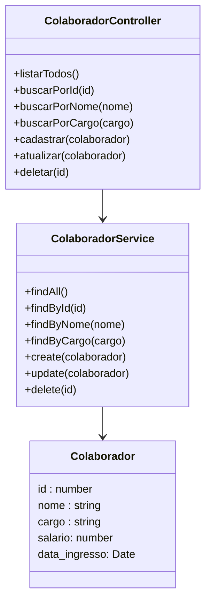
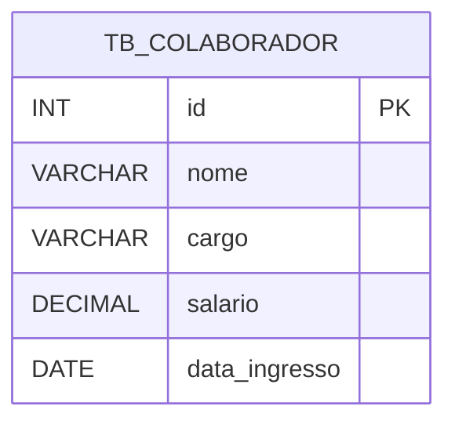

# Constella RH - Backend

 

  
  
  
  
  
  
  

  

## 1. Descrição

Este projeto explora como a tecnologia pode estruturar e organizar aquilo que sustenta qualquer empresa: as pessoas.

A aplicação demonstra, de forma clara e funcional, como sistemas podem registrar e gerenciar informações de colaboradores, refletindo princípios fundamentais da engenharia de software como organização, clareza de dados e arquitetura simples.

------

## 2. Sobre esta API

O **Constella RH** é uma API backend de sistema de gestão de colaboradores desenvolvida para simular um cenário comum em ambientes corporativos: o registro e organização de informações de colaboradores.

A aplicação implementa operações de cadastro e visualização de dados, demonstrando na prática a estruturação de um CRUD aplicado a um contexto de gestão de pessoas.

O projeto foi desenvolvido com fins educacionais, simulando uma aplicação real utilizada em ambientes profissionais, com foco na construção de **APIs REST escaláveis utilizando NestJS e TypeScript**.

### 2.1. Principais Funcionalidades

1. Criação, edição e exclusão de colaboradores
2. Registrar e organizar informações como nome, cargo, salário e data de entrada do colaborador.
3. Busca de colaboradores por nome ou por cargo

Cada registro representa um novo integrante no sistema, estruturando os dados de forma clara e consistente.

------

## 3. Diagrama de Classes

O diagrama abaixo representa a estrutura lógica da entidade da aplicação dentro da API.

------

## 4. Diagrama Entidade-Relacionamento (DER)
O DER representa como os dados estão organizados no banco relacional.

------

## 5. Tecnologias utilizadas

| Item                          | Descrição  |
| ----------------------------- | ---------- |
| **Servidor**                  | Node JS    |
| **Linguagem de programação**  | TypeScript |
| **Framework**                 | Nest JS    |
| **ORM**                       | TypeORM    |
| **Banco de dados Relacional** | MySQL      |

------

## 6. Configuração e Execução

1. Clone o repositório
2. Instale as dependências: `npm install`
3. Configure o banco de dados no arquivo `app.module.ts`
4. Execute a aplicação: `npm run start:dev`

## 7. Autores

**Orbyte - Onde as ideias orbitam em torno de conhecimento e tecnologia**

🔗 **GitHub:** https://github.com/grupo6-js13/

🔗 **E-mail:** grupo6js13@gmail.com 

Projeto desenvolvido para **aprendizado contínuo**, **demonstração técnica** e **portfólio profissional**.
